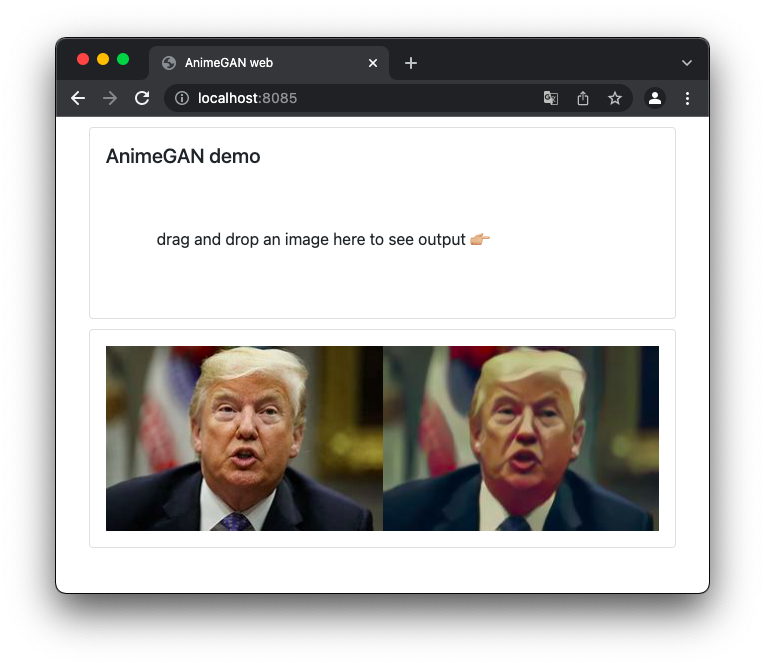

##  AnimeGAN web

this project is basic on https://github.com/bryandlee/animegan2-pytorch Implementation of [AnimeGANv2](https://github.com/TachibanaYoshino/AnimeGANv2)

### clone

```
git clone https://github.com/codetyphon/AnimeGAN-web
```

### install
```
cd AnimeGAN-web
python3 -r requirements.txt
```

### start web

```
python3 api.py
```

visit: http://localhost:8085




### test API in terminal

```
curl --header "Content-Type: application/json" \
  --request POST \
  --data 'R0lGODlhDwAPAKECAAAAzMzM/////wAAACwAAAAADwAPAAACIISPeQHsrZ5ModrLlN48CXF8m2iQ3YmmKqVlRtW4MLwWACH+H09wdGltaXplZCBieSBVbGVhZCBTbWFydFNhdmVyIQAAOw==' \
  http://localhost:8085/api/cartoon
```

### update 

2021-12-18

dnd-web (React)

wechatClient (miniProgram)